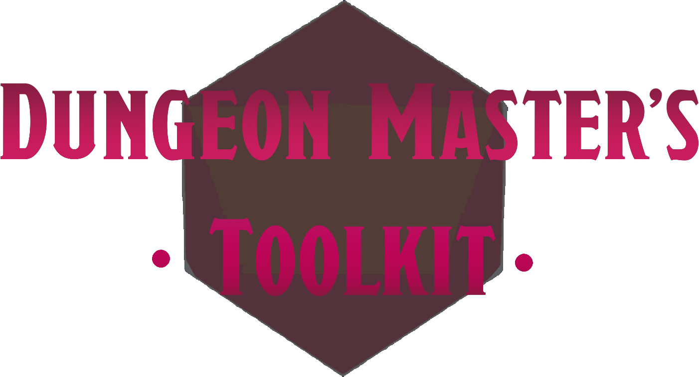
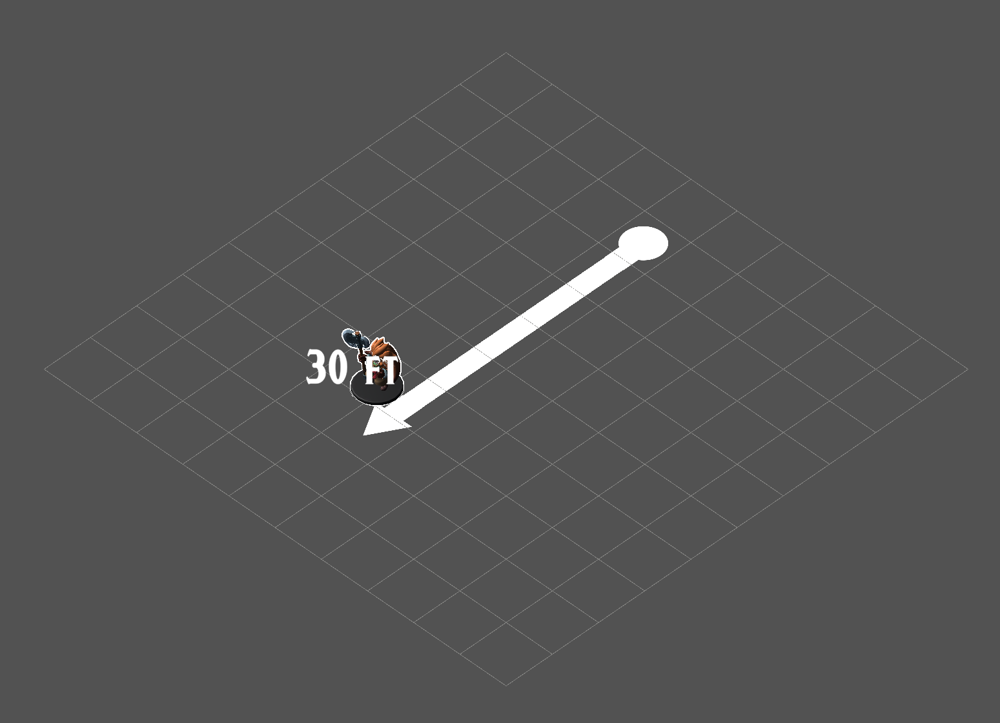
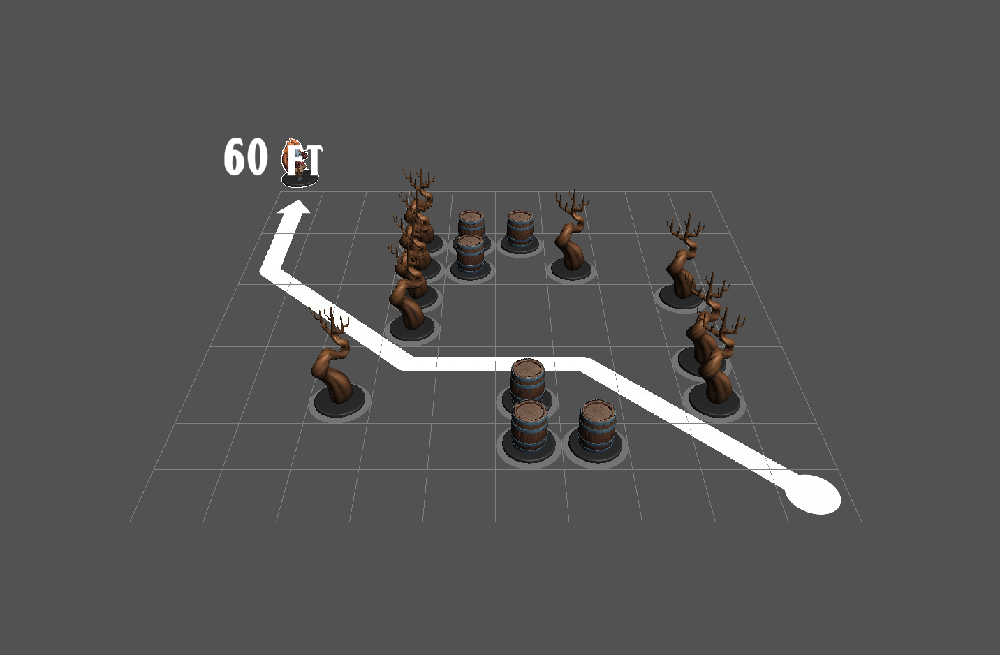

# Dungeon Master's Toolkit (DMTK)

  

Digital Dungeons and Dragons (D&D) tabletop simulation software aiming to replicate the basic functions and traditional  
benefits of a real-world tabletop and miniatures. Primary goals include: (1) simplistic user interface, and (2) supplementary  
approach.  
Made in the Unity game engine.  
Submitted as final year project at Bournemouth University (2024).  

You can experiment with the current iteration of DMTK - [here.](https://drive.google.com/file/d/1x-TO18jtQdVU7JpsM8zHtiMLFH9g9OQn/view?usp=sharing)  

# Current Video Demonstration
[Dungeon Master's Toolkit: Project Submission Video Demo](https://drive.google.com/file/d/1BzYSGWYJ4pYE8YUSZsKow5Rn8u8sEaCE/view?usp=sharing)  
